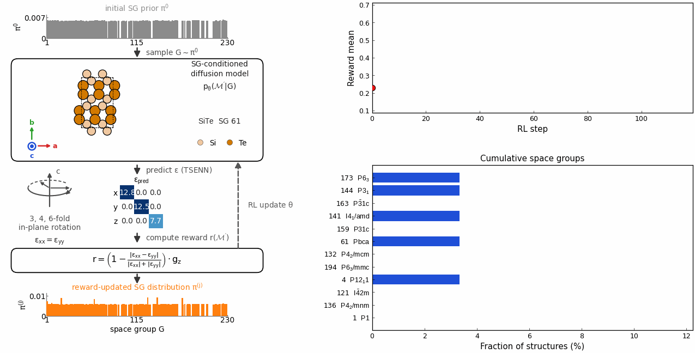

# SPARC
**S**ymmetry- and **P**roperty-**A**ware **R**einforcement Learning for **C**rystal Generation 
<p align="center">
  
</p>

SPARC inversely designs crystal symmetry from a desired physical response.

The animation above presents our flagship example. The target is an in-plane-isotropic dielectric response, $\varepsilon_{xx}=\varepsilon_{yy}$. As the reward increases, the sampled space-group distribution concentrates within uniaxial crystal families. The model therefore discovers the crystal symmetries that are compatible with the target response.

SPARC achieves this by fine-tuning the symmetry-aware crystal diffusion model SymmCD through reinforcement learning.


> Paper: _add citation / link here._

## Repository layout
- `main.py` — Hydra entry point (instantiates `pipeline.sparc.SPARC` and calls `run_rl`)
- `configs/` — Hydra configs (`base.yaml`, `model/`, `pipeline/`, `reward/`, `logger/`)
- `models/` — model suites (`suite/symmcd.py`, `suite/diffcsp.py`, `suite/mattergen.py`) with the SymmCD diffusion model lives under `models/symmcd/`
- `pipeline/`, `rewards/`, `memory/` — RL loop, reward calculators, replay buffer
- `utils/assets.py` — auto-downloads large assets from HuggingFace on first use
- `scripts/` — portable helpers + the dielectric run submit scripts (`scripts/dielectric_*_b96*.sbatch`); `scripts/nersc/` holds the author's original NERSC scripts (reference only)
- `RUNS.md` — catalog of published runs and their commands

## 1. Install (single `uv` environment)
Requires [uv](https://docs.astral.sh/uv/). The pinned wheels target **CUDA 11.8 (`cu118`)**; any driver supporting CUDA ≥ 11.8 works. 

```bash
git clone git@github.com:AngusHsuPhys/sparc_v0.git
cd sparc_v0
uv sync --frozen
```
This installs `torch 2.2.1+cu118`, PyG (`torch_scatter/sparse/cluster`), MatterGen (pinned to `v1.0.3`), the materials stack (pymatgen / ase / e3nn / atomate2 / mattersim), and `sparc` itself (editable). Then either `source .venv/bin/activate` or prefix commands with `uv run`.

## 2. Assets (auto-downloaded from HuggingFace)
Model checkpoints and datasets (~13 GB) are **not** in git — they live in the HuggingFace repo `AngusHsuPhys/sparc-assets` and download automatically the first time each file is needed, landing at the exact paths the configs/checkpoints expect (no config edits required). While the repo is private, authenticate once:
```bash
huggingface-cli login        # or: export HF_TOKEN=hf_xxx
```
Optionally prefetch (handy before submitting a job, or on a login node that shares the filesystem with offline compute nodes):
```bash
python scripts/download_assets.py        # ~4.2 GB "core": surrogates + mp_20 + SymmCD base
python scripts/download_assets.py --all  # also the ~8.6 GB caches (only needed to re-train surrogates)
```
Groups: **core** (run the experiments), **cached** (re-train surrogates), **optional** (also in git).
Env knobs: `SPARC_HF_REPO`, `SPARC_HF_REPO_TYPE`, `SPARC_SKIP_ASSET_DOWNLOAD`, `HF_HUB_OFFLINE`.

SPARC also pulls a few *third-party* weights on first use. Including the MatterSim potential + a MatterGen reference dataset (in the structure filter). These download automatically when online. If your GPU nodes have no internet but share `~/.cache/huggingface` (and the repo) with an internet-connected login node, warm everything once on the login node, then run jobs offline:
```bash
python scripts/download_assets.py     # SPARC assets -> repo paths
python scripts/warm_caches.py         # third-party MatterSim / MatterGen 
# then in the job:  export HF_HUB_OFFLINE=1 SPARC_SKIP_ASSET_DOWNLOAD=1
```

### Paper run bundles — download & visualize the results
The RL runs behind the paper figures are published in the **same repo** under `runs/<name>/` as lightweight *visualization bundles*
```bash
python scripts/download_paper_runs.py            # all 5 runs -> exp_res/<name>/
python scripts/download_paper_runs.py --list     # show the run names
python scripts/download_paper_runs.py --runs dielectric_inplane_isotropy_gapgate_mprime_newbg_b96

## 3. Quickstart smoke test
```bash
source scripts/env.sh        # sets PROJECT_ROOT (required) + runtime dirs
python main.py \
  expname=smoke pipeline=sparc model=symmcd reward=band_gap_e3nn \
  logger=csv device=cuda eval_size=12 rl_epoch=2 \
  model.model_path="$MODEL_PATH" seed=1 deterministic_torch=true
```
Downloads the SymmCD base + the E3NN band-gap surrogate, samples a few crystals, scores them, runs 2 RL steps, and writes `exp_res/smoke/{metrics.csv,samples/}`.

## 4. Reproduce the key experiments
Run from the repo root (so `${hydra:runtime.cwd}` resolves to the project root). These are representative commands; the exact published overrides (adaptive space-group knobs, batch sizes, etc.) live in the `scripts/*.sbatch` submit scripts and `RUNS.md`.

**Dielectric — in-plane isotropy (the flagship run, shown in the animation above).**
Drives `ε_xx = ε_yy` (in-plane isotropy — the signature of the trigonal/tetragonal/hexagonal families; cubic is excluded by a light z-anisotropy floor), gated by band gap ≥ 0.3 eV so candidates stay non-metallic and worth DFT verification:
```bash
python main.py expname=dielectric_inplane_isotropy pipeline=sparc model=symmcd \
  reward=fom_inplane_isotropy_gapgate logger=csv device=cuda \
  eval_size=30 rl_epoch=120 seed=1 deterministic_torch=true \
  model.model_path="$MODEL_PATH" \
  model.sample_cfg.generation_batch_size=96 model.sample_cfg.batch_size=96
```
MLIP relaxation is on by default; the no-relax ablation adds `+sample_cfg.filter.relax=false`, and a DiffCSP-backbone ablation is provided (see `scripts/dielectric_inplane_isotropy_gapgate_diffcsp_*.sbatch`).

**SLME — band gap + solar-cell efficiency (η).**

Weighted reward: 0.2·band gap + 0.8·SLME η. The band-gap term is a hard-zero tent centered at 1.3 eV (the Shockley–Queisser optimum), scored with the project's own E3NN band-gap model; η is integrated over the AM1.5G spectrum from that gap up at 0.3 µm thickness (all set in the reward config):
```bash
python main.py expname=slme_bgcenter13_eta08 pipeline=sparc model=symmcd \
  reward=tsenn_slme_optimate_bgcenter13_eta08_e3nngap logger=csv device=cuda \
  eval_size=30 rl_epoch=120 seed=1 deterministic_torch=true \
  model.model_path="$MODEL_PATH" \
  model.sample_cfg.generation_batch_size=128 model.sample_cfg.batch_size=128 \
  model.sample_cfg.finetune_on_representative=true
```

Band-gap target:
```bash
python main.py expname=bandgap pipeline=sparc model=symmcd \
  reward=band_gap_e3nn logger=csv device=cuda eval_size=24 rl_epoch=200 \
  seed=1 deterministic_torch=true model.model_path="$MODEL_PATH"
```

## 5. Reproducibility
`seed=1 deterministic_torch=true` seeds python/numpy/torch and enables deterministic algorithms (`CUBLAS_WORKSPACE_CONFIG`, cuDNN deterministic). Results reproduce as **trends**; bitwise identity additionally requires the same GPU architecture + driver and the pinned `cu118` wheels. A few third-party ops remain nondeterministic (run with `warn_only`).


## License
See [`LICENSE`](LICENSE).
